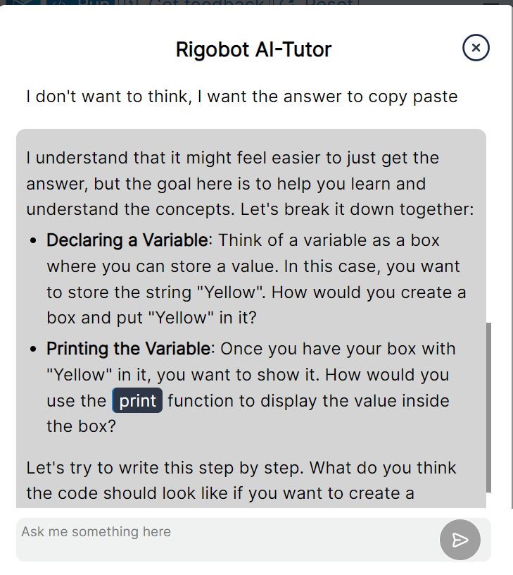
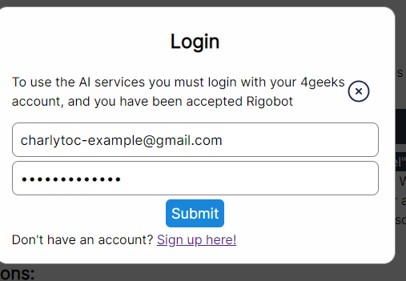
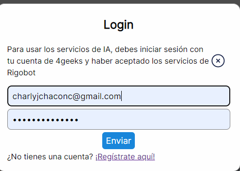
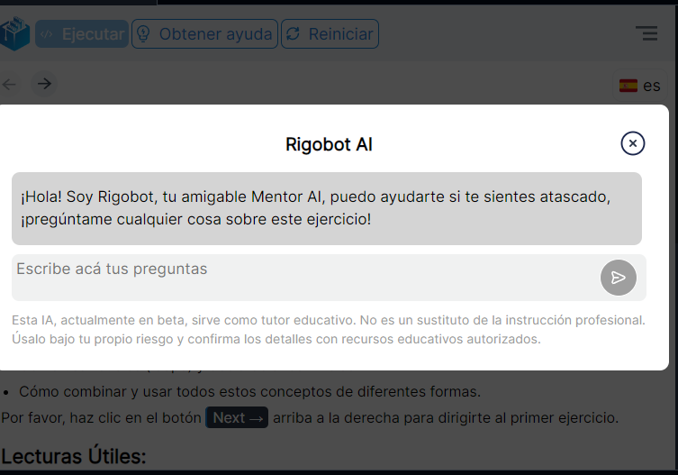

# Rigobot: Tecnología de última generación en tu código

Rigobot es el motor que mueve varias aplicaciones de IA dentro de 4Geeks.com, incluído el mentor AI integrado en LearnPack. 
Vamos a explorar un poco más sobre cómo usar Rigobot en LearnPack y lo que puede hacer.

## Cómo empezar a usar el Mentor AI de LearnPack
### Paso 1: Inicia cualquier tutorial de LearnPack
Aquí tienes una [lista de tutoriales disponibles en el momento](https://github.com/4GeeksAcademy/Interactive-Tutorials).

> Note: Iniciar un tutorial es tan fácil como hacer un fork en tu perfil, y crear un codespace, abrirlo en gitpod, o seguir las instrucciones de instalación en local.

### Paso 2: Haz hover sobre `Obtener feedback`

### Paso 3: Da click en la opción de `Login`

### Paso 4: Coloca tus credenciales de 4Geeks

### Paso 5: Envía el formulario... ¡Y listo!
En caso de que no tengas una cuenta [puedes crear una acá](https://4geeks.com/pricing)

> Para usar los servicios de Rigobot tendrás que aceptarlos una vez creas una cuenta en 4Geeks, si LearnPack detecta que aún no lo has hecho te dará un link para que puedas aceptarlo.