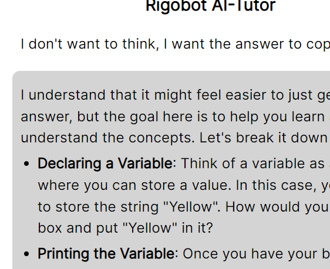

# Rigobot: Tu aliado en el aprendizaje
Rigobot es el motor que mueve varias aplicaciones de IA dentro de 4Geeks.com, incluido el mentor AI integrado en LearnPack. Vamos a explorar un poco más sobre cómo usar Rigobot en LearnPack y lo que puede hacer. Además de los beneficios de tener **feedback contínuo** durante el aprendizaje.

## Cómo empezar a usar el Mentor AI de LearnPack
### Paso 1: Inicia cualquier tutorial de LearnPack
Aquí tienes una [lista de tutoriales disponibles en el momento](https://github.com/4GeeksAcademy/Interactive-Tutorials).

> Nota: Iniciar un tutorial es tan fácil como hacer un fork en tu perfil, crear un codespace, abrirlo en Gitpod, o seguir las instrucciones de instalación en local.

### Paso 2: Haz hover sobre `Obtener feedback`

### Paso 3: Haz click en la opción de `Login`

### Paso 4: Coloca tus credenciales de 4Geeks

### Paso 5: Envía el formulario... ¡Y listo!
En caso de que no tengas una cuenta, [puedes crear una acá](https://4geeks.com/pricing).

> Para usar los servicios de Rigobot tendrás que aceptarlos una vez crees una cuenta en 4Geeks. Si LearnPack detecta que aún no lo has hecho, te dará un enlace para que puedas aceptarlo.

## Cómo abrir el chat
#### Dentro del menú `Obtener feedback`
- Haz hover sobre el menú `Obtener feedback`
- Haz clic en la opción `chat with Rigo`
#### Usando acceso por teclado
- Con LearnPack enfocado, presiona `Ctrl` + `Alt` + `Enter` para abrir/cerrar el modal del chat

## Beneficios de tener un mentor AI
Más allá de la evidente ayuda que representa la inteligencia artificial, exploremos la diferencia entre un Mentor AI y un Copiloto de Programación. En el corazón de Rigobot, puede ser cualquiera de los dos, ya que permite customizar el comportamiento de una IA usando técnicas de prompting y un manejo óptimo del contexto.

#### El tutor AI de LearnPack no te va a dar la respuesta
La idea de tener un mentor es servir como guía para que el estudiante encuentre la respuesta por su cuenta. El mentor de LearnPack tiene conocimiento del código y las modificaciones que haces, posee memoria de las últimas 4 interacciones y te responderá en el idioma de tu preferencia. Puedes pedirle que te explique algo de la forma en que sea más fácil para ti.

Esto trae como beneficio que tengas que repasar constántemente conceptos y asociándolos al código que estás escribiendo.

#### Feedback contínuo
El [proceso de aprendizaje require de varios factores](https://4geeks.com/mastering-technical-knowledge#feedback-quality-and-frequency), uno de ellos es la calidad y cantidad de feedback que recibes en lo que estás haciendo. Con el **mentor AI de LearnPack** dándote feedback constántemente, el resultado de los tests, los tutoriales, o incluso archivos de solución hacen imposible que no puedas avanzar por tu cuenta, ve a tu ritmo, repite los pasos si deseas presionan el botón de **Resetear** al lado de **Obtener feedback**.

