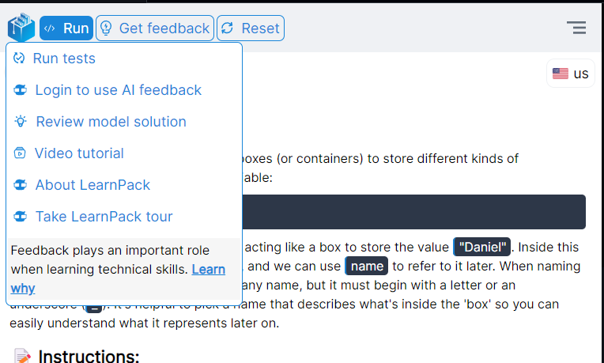
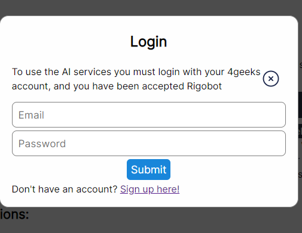
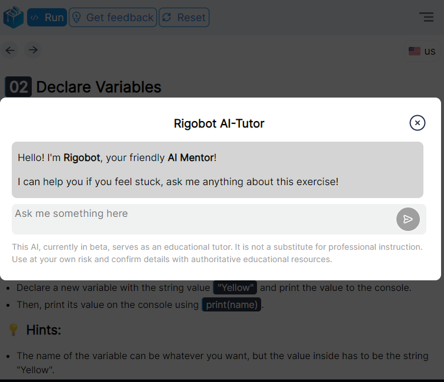

# Rigobot: Cutting-Edge Technology in Your Code

Rigobot is the engine that powers various AI applications within 4Geeks.com, including the integrated AI mentor in LearnPack. Let's explore a bit more about how to use Rigobot in LearnPack and what it can do.

## How to Start Using the LearnPack AI Mentor

### Step 1: Start Any LearnPack Tutorial
Here is a [list of available tutorials at the moment](https://github.com/4GeeksAcademy/Interactive-Tutorials).

> Note: Starting a tutorial is as easy as forking it to your profile, creating a codespace, opening it in Gitpod, or following the local installation instructions.

### Step 2: Hover Over `Get Feedback`

### Step 3: Click on the `Login` Option

### Step 4: Enter Your 4Geeks Credentials

### Step 5: Submit the Form... And You're Done!
If you don't have an account, [you can create one here](https://4geeks.com/pricing).

> To use Rigobot's services, you will need to accept them once you create an account on 4Geeks. If LearnPack detects that you haven't done so yet, it will provide a link for you to accept it.